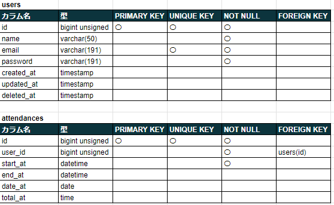
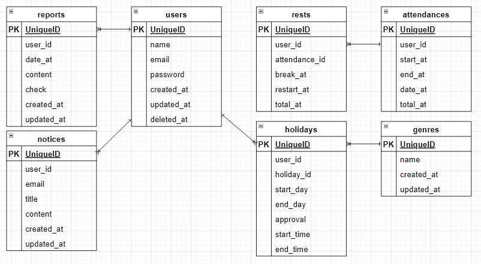

## アプリケーション情報

■ アプリケーション名 
Admit 

■ プロダクト概要 
ある企業の勤怠を管理するシステム 

■ トップ画像 

## アプリケーション URL
https://admin.waterfall32-breeze.com/

## 使用技術(実行環境)
■ 使用言語 
HTML 
CSS 
JavaScript 
PHP 8.2.13 

■ 使用フレームワーク 
Laravel Framework 10.34.2 

■ 認証スターターキット 
Fortify 

## 機能一覧
新規登録 
ログイン 
勤務開始 
勤務終了 
休憩開始 
休憩終了 
勤怠一覧表示 
時間外一覧表示 
休暇申請 
休暇申請一覧表示 
日報報告 
日報報告一覧表示 
日報報告詳細表示 
メール通知 

## テーブル設計

## ER 図

## 画面遷移図

## 環境構築
■ 開発環境 
[土台] 
Docker(Laravel Sail) 
LinuxOS 
[操作] 
ubuntu 
VSCode 
[サーバー] 
nginx 
[データベース] 
mysql 
[管理] 
Git 
GitHub 

## その他
■ ログイン用ダミーデータ 
・2件 

〇社員 
・メールアドレス：test1@test.com 
・パスワード　　：test1111 
〇管理者 
・メールアドレス：owner@owner.com 
・パスワード　　：owner1111 

■ 勤怠ダミーデータ 
・18件 
